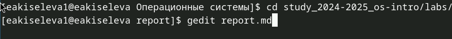
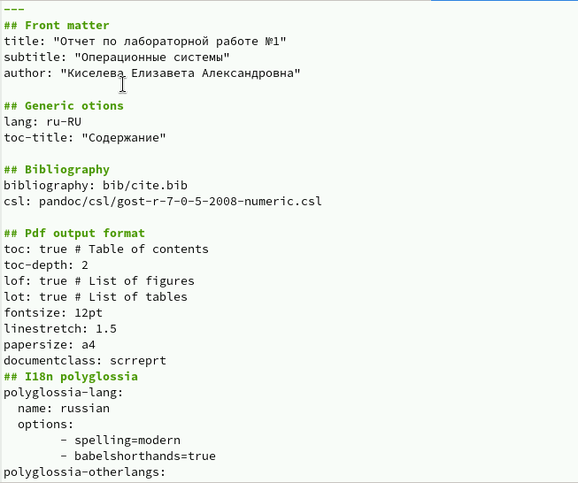

---
## Front matter
lang: ru-RU
title: Лабораторная работа №1
subtitle: Операционные системы
author:
  - Киселева Е. А., НКАбд-02-24
institute:
  - Российский университет дружбы народов, Москва, Россия
date: 05.02.2025

## i18n babel
babel-lang: russian
babel-otherlangs: english

## Formatting pdf
toc: false
toc-title: Содержание
slide_level: 2
aspectratio: 169
section-titles: true
theme: metropolis
header-includes:
 - \metroset{progressbar=frametitle,sectionpage=progressbar,numbering=fraction}
---

# Цель работы

Цель данной лабораторной работы - научиться оформлять отчёты с помощью легковесного языка разметки Markdown.

# Задание

1. Сделайте отчёт по предыдущей лабораторной работе в формате Markdown.
2. В качестве отчёта предоставляются отчёты в 3 форматах: pdf, docx и md (в архиве,
поскольку он должен содержать скриншоты, Makefile и т.д.)

# Теоретическое введение

Markdown — облегчённый язык разметки, созданный с целью обозначения форматирования в простом тексте, с максимальным сохранением его читаемости человеком, и пригодный для машинного преобразования в языки для продвинутых публикаций.

# Выполнение лабораторной работы

Перехожу в каталог, в котором находится шаблон для отчета по лабораторной работы, с помощью утилиты cd. 

{#fig:001 width=70%}

Открываю файл с помощью текстового редактора gedit. После изменения шаблона в соответсвии с языком разметки Markdown, я выполнила его компиляцию из формата md в форматы docx и pdf. Далее отправила созданные и скомпилированные файлы на глобальный репозиторий.

{#fig:002 width=70%}

# Выводы

При выполнении данной лабораторной работы я научилась оформлять отчеты с помощью легковесного языка разметки Markdown.

